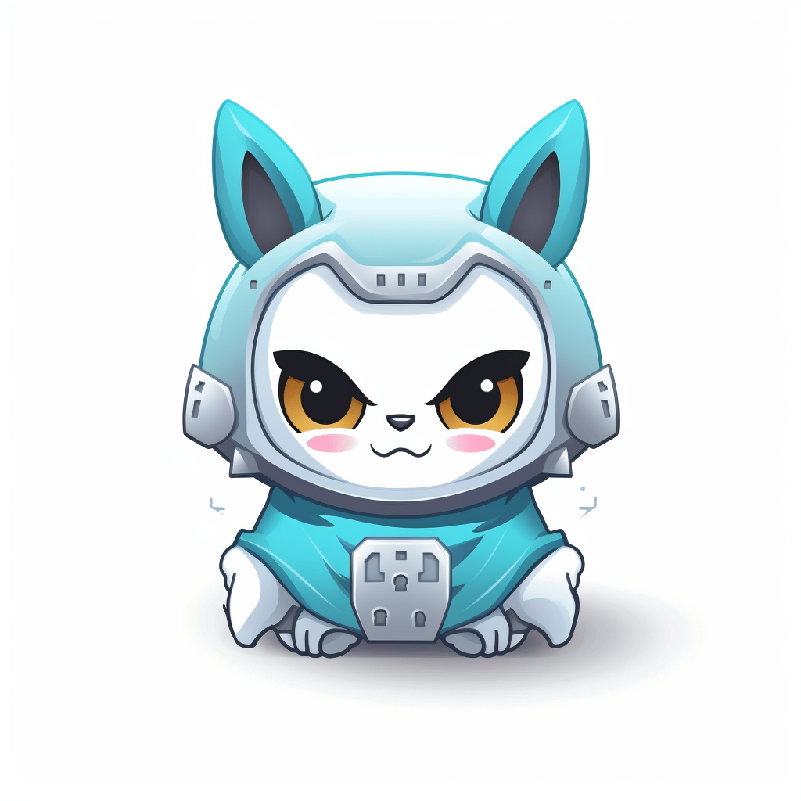

# DebtGuardian.AI




**DebtGuardian.AI** is an AI-powered scanner designed to detect and resolve technical and security debt in GitHub repositories. It ensures your code is clean and secure, simplifying code maintenance.

## Pre-requisites
- `!pip install pydriller`
- `!pip install requests`
- `!pip install openai==0.28.1`
- `!pip install pygments`
- `!pip install pydantic==1.10.9`
- `!apt-get install -y graphviz openjdk-11-jre-headless`
- `!pip install guardrails-ai typing rich`
- `!pip install tiktoken`


**Usage**


Set OpenAI environment variable

export OPENAI_API_KEY='your_api_key_here'


Update OpenAI engine information in main.py. It's currently set to our OpenAI running on our Azure deployment

- engineName="jaipetefort"
- openai.api_type = "azure"
- openai.api_base = "https://03.openai.azure.com/"
- openai.api_version = "2023-07-01-preview"


Command to find technical and security debts

>python3 main.py GitHub-Repo-Address

An example of a GitHub Repo  is https://github.com/Tripletex/tripletex-api2.git 

Command to resume detection of technical and security debts if stopped midway

>python3 main.py GitHub-Repo-Address  --resume 

**Output**

The program generates <GitHub Repo>_debts.json

Here is an example snippet for debts found in a GitHub Repo:

```json
"bbcd50c734902901cc54c61e5e03038ebe6ffebf": {
    "snippet_functionality": "This code snippet is used to authenticate a user with the Tripletex API using consumer and employee tokens. It creates a session token that is valid for one hour from the current time.",
    "number_of_lines": 26,
    "securityDebts": [
        {
            "type": "Hardcoded Secrets",
            "symptom": "The code snippet uses hardcoded values for authentication.",
            "affected_area": "Lines 20-21",
            "suggested_repair": "Use environment variables or a secure configuration file to store sensitive information such as tokens."
        },
        {
            "type": "Improper Session Management",
            "symptom": "The session token is set to expire after one hour without any mechanism for renewal or invalidation.",
            "affected_area": "Line 18",
            "suggested_repair": "Implement a mechanism to renew or invalidate the session token as needed."
        }
    ],
    "technicalDebts": [
        {
            "type": "Error/Exception Handling",
            "symptom": "The code does not handle potential exceptions that may be thrown by the Tripletex API.",
            "affected_area": "Lines 15-23",
            "suggested_repair": "Wrap the API calls in a try-catch block and handle potential exceptions appropriately."
        },
        {
            "type": "Hard-coded Values",
            "symptom": "The username is hardcoded to '0'.",
            "affected_area": "Line 22",
            "suggested_repair": "Avoid hardcoding values. Use a variable or constant instead."
        }
    ],
    "location": "example/java-gradle/order/src/main/java/no/tripletex/example/order/Example.java",
    "repository": "https://github.com/Tripletex/tripletex-api2.git"
}
